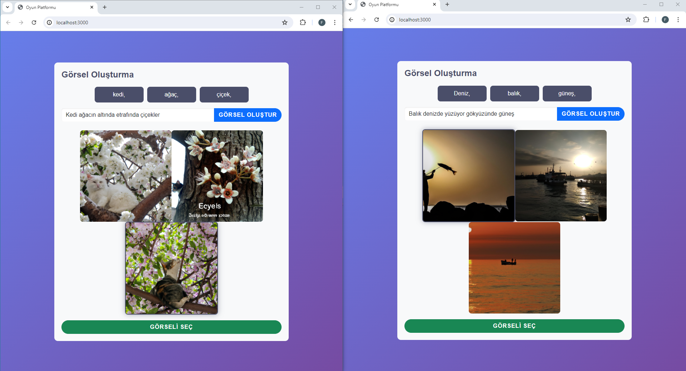
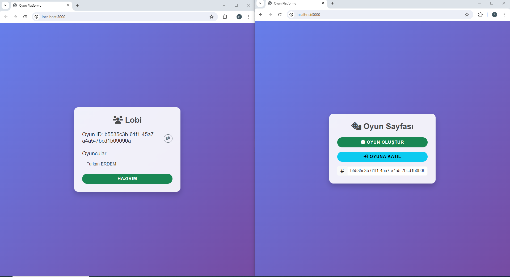
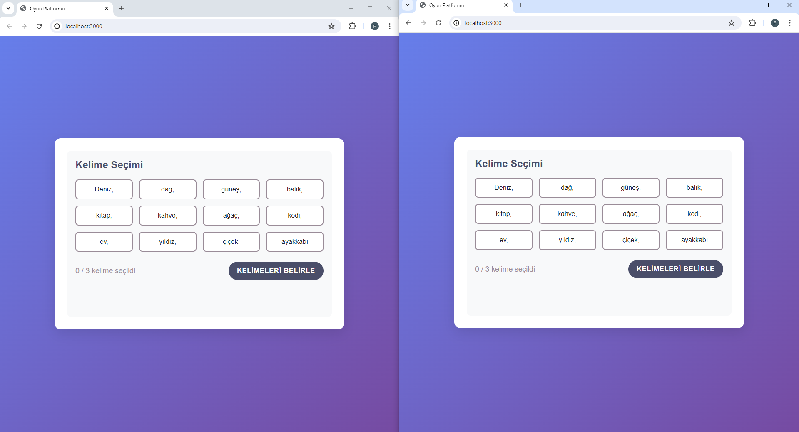
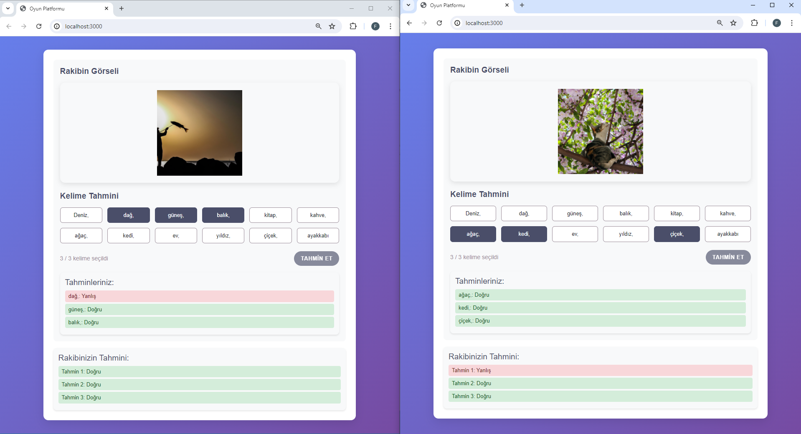

# AI Kelime & Görsel Oyunu

İki oyuncunun gerçek zamanlı olarak karşılaştığı, yapay zekâ destekli bir kelime tahmin oyunu. Oyuncular seçtikleri kelimelerle bir cümle kurar, **DALL-E** bu cümleden görsel üretir ve rakip, sadece görsele bakarak hangi kelimelerin seçildiğini tahmin etmeye çalışır.

Kırıkkale Üniversitesi Bilgisayar Mühendisliği **Bitirme Projesi 2** kapsamında geliştirilmiştir (Haziran–Temmuz 2024).



## Nasıl oynanır?

1. **Giriş ve lobi:** Oyuncu kullanıcı adıyla giriş yapar, oyun oluşturur ve oyun kodunu rakibiyle paylaşır. Rakip bu kodla oyuna katılır.
2. **Kelimeler:** İki oyuncu da "Hazırım" dediğinde 5 saniyelik geri sayım başlar. **GPT-4** 12 Türkçe kelime üretir ve iki oyuncuya da aynı kelimeler gösterilir.
3. **Görsel üretme:** Her oyuncu 12 kelimeden 3'ünü seçer ve bu kelimelerle bir cümle yazar (örneğin *"Kedi ağacın altında, etrafında çiçekler"*). **DALL-E** bu cümleden 3 görsel üretir, oyuncu birini seçer.
4. **Tahmin:** Oyunculara rakibin seçtiği görsel gösterilir. Oyuncular 12 kelime arasından rakibin hangi 3 kelimeyi seçtiğini tahmin eder.
5. **Sonuç:** Her doğru tahmin 1 puandır. İki oyuncu da kendi sonucunu ve rakibinin sonucunu anlık olarak görür.

| Lobi | Kelime seçimi | Tahmin |
|---|---|---|
|  |  |  |

## Teknolojiler

| Katman | Teknolojiler |
|---|---|
| Sunucu | Node.js, Express |
| Gerçek zamanlı iletişim | WebSocket (`ws`) |
| Yapay zekâ | OpenAI API: GPT-4 (kelime üretimi), DALL-E 2 (görsel üretimi) |
| Arayüz | HTML, CSS, JavaScript, jQuery, Bootstrap 5 |

## Mimari

Tek bir Node.js süreci hem statik arayüz dosyalarını (Express) hem de oyun trafiğini (WebSocket) aynı port üzerinden sunar. İstemci ile sunucu arasındaki bütün iletişim `type` alanı taşıyan JSON mesajlarıyla yapılır.

```
Tarayıcı (public/)                       Sunucu (index.js)
──────────────────                       ─────────────────
create / join        ──────────────▶     GameManager   → oyun odaları
ready                ──────────────▶     ClientManager → bağlı oyuncular
                     ◀──────────────     countdown, gameStart (12 kelime)   ← WordGenerator  (GPT-4)
generate (cümle)     ──────────────▶
                     ◀──────────────     images (3 görsel)                   ← ImageGenerator (DALL-E)
selectImage          ──────────────▶
                     ◀──────────────     opponentImage
guessWords           ──────────────▶
                     ◀──────────────     guessResult, opponentGuessResult, gameEnd (skorlar)
```

- **`GameManager` / `ClientManager`:** Oyun odalarını ve bağlı oyuncuları bellekte tutar, skorları hesaplar.
- **`WordGenerator` / `ImageGenerator`:** OpenAI çağrılarını sarmalar. Görsel isteklerinde API hız sınırına takılmamak için istekler arasında en az 12 saniye beklenir.

## Kurulum

**Gereksinimler:** Node.js 20.6 veya üzeri, bir [OpenAI API anahtarı](https://platform.openai.com/api-keys)

```bash
git clone https://github.com/Furkanrdmm/ai-kelime-gorsel-oyunu.git
cd ai-kelime-gorsel-oyunu
npm install
```

`.env.example` dosyasını `.env` olarak kopyalayıp API anahtarınızı girin:

```
OPENAI_API_KEY=sk-...
```

```bash
npm start
```

Oyun `http://localhost:3000` adresinde açılır. Denemek için iki farklı tarayıcı sekmesi açıp birinde oyun oluşturun, diğerinde oyun koduyla katılın.

**İsteğe bağlı ayarlar:** `PORT`, `OPENAI_TEXT_MODEL` (varsayılan `gpt-4`) ve `OPENAI_IMAGE_MODEL` (varsayılan `dall-e-2`) değişkenleri `.env` üzerinden değiştirilebilir. Görsel modeli, yanıtında görsel URL'i döndüren bir model olmalıdır.

## Bilinen kısıtlar

- Oyun durumu sunucu belleğinde tutulur. Sunucu yeniden başlarsa devam eden oyunlar kaybolur.
- Bir oyun 2 oyuncu için tasarlanmıştır.
- DALL-E'nin döndürdüğü görsel adresleri geçicidir, yaklaşık 1 saat sonra geçerliliğini yitirir.

## Ekip

| Kişi | Katkı |
|---|---|
| **Kerem** | Sunucu tarafı: oyun yönetimi ve WebSocket altyapısı |
| **[Furkan Erdem](https://github.com/Furkanrdmm)** | Arayüz: tüm oyun ekranları, istemci tarafı oyun akışı |
| Birlikte | OpenAI (GPT-4 ve DALL-E) entegrasyonu |

### Sonradan yapılan iyileştirmeler (2026)

Proje GitHub'a yüklenirken şu düzeltmeler yapıldı:
- Koda gömülü API anahtarı kaldırıldı, anahtar ortam değişkeninden okunuyor
- Oyun sonunda skor hesaplanırken sunucunun çökmesine yol açan hata düzeltildi
- Hatalı WebSocket mesajlarının sunucuyu kapatması engellendi
- Oyun `localhost` dışında da çalışabilir hale getirildi (WebSocket adresi, port ve model ayarları)
- GPT'nin kelimeleri virgülle döndürmesinden kaynaklanan görüntü hatası düzeltildi
- Kullanılmayan kod ve bağımlılıklar temizlendi
